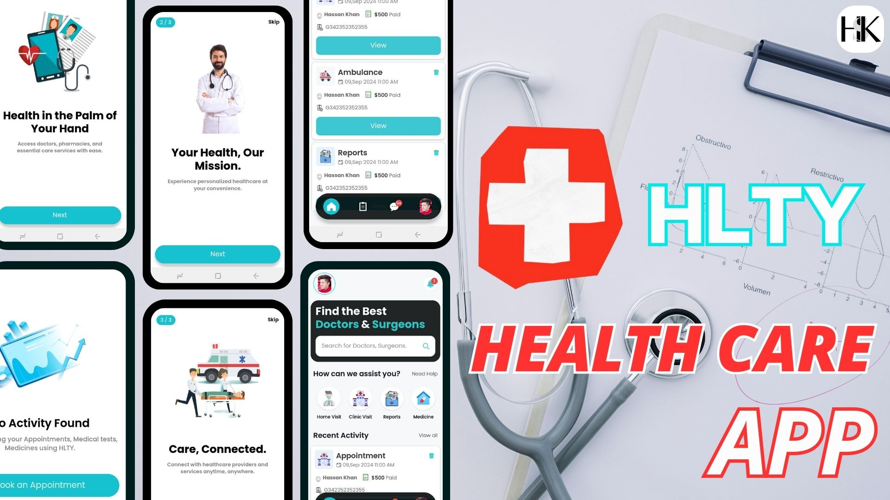

  

# 🏥 Healthcare App UI - React Native
A sleek and intuitive React Native healthcare app UI, designed for seamless user experience and easy navigation. This template is perfect for healthcare service providers looking to streamline user interaction and engagement. Explore features designed with accessibility and functionality in mind, including authentication, appointment management, chat support, and personalized notifications.

# ✨ Key Features

🚀 Splash Screen
A visually engaging splash screen that welcomes users to the app.

 **🔐 Authentication**
*  **Login Screen**: Simple and secure user login interface.
*  **Sign Up Screen**: User-friendly sign-up with email OTP verification and success confirmation modal for email validation.
*  **Forgot Password**: Includes OTP-based password reset flow to ensure security and simplicity.

**🏠 Home Screen**
*  **Search Bar**: Quickly access services and information.
*  **Services Slider**: Highlight essential services at a glance.
*  **Recent Activities**: View recent actions like appointments, reports, medicine purchases, and ambulance services.

 **📅 Appointments Screen**
*  **Upcoming and Completed Tabs**: Manage and review appointments in separate tabs for easy tracking.
  
**💬 Chats Screen**
* **Search Bar**: Easily find and connect with doctors.
* **Chatroom**: Engaging chatroom interface for real-time conversations.
  
**👤 Profile Screen**

* **Profile Image and Edit Options**: Easily update profile details and manage personal info.
* **Logout Button with Confirmation Modal**: Ensures secure log-out with a confirmation option.

**🔔 Notifications Screen**

* Lists various types of notifications to keep users updated on important events and reminders.

# 📱 Additional Screens and Features
OTP Modals for secure verification.
Confirmation Modals across key actions to enhance user experience and security.
Intuitive Navigation and UI Design for a seamless user experience.
